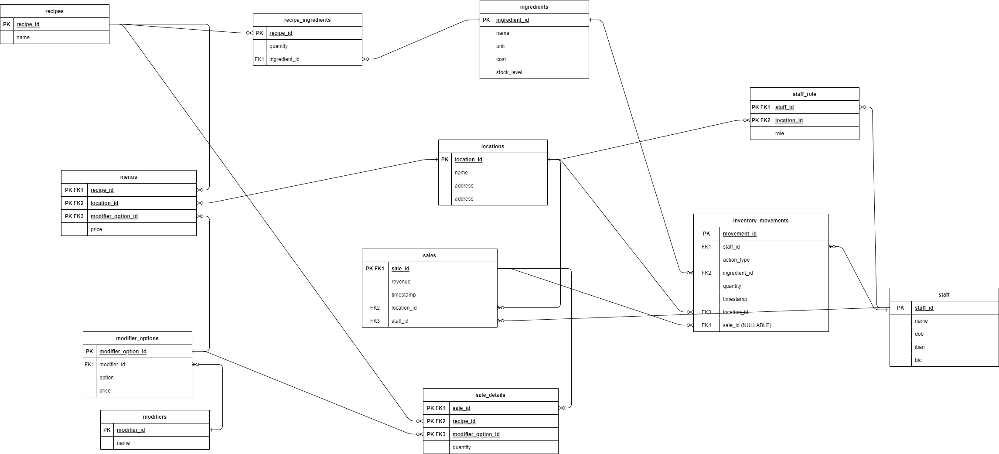

# Project Weird Salads

## Acceptance Criteria

- Inventory management application is conceptualized
- Proof of concept is developed
- Application is not public facing
- Application is cross platform (Windows, MacOS, Linux)
- Application is hosted locally
- Staff are able to perform the following
    - Add stock entries (log deliveries)
    - Delete stock (acccount for wastage)
    - Add orders (Sell items)
    - Generate inventory trail reports (See who/what modified stock and when)
    - Dashboards:
        - Total cost of deliveries 
        - Total sale revenue
        - Total value of current inventory
        - Cost of recorded waste

## Assumptions
- There is no existing tool or solution readily available
- The POC prioritizes important logic. (Authentication and Authorization, Security concerns, Updates to the appliation are not handled as part of this POC)
- The pros/cons of this approach have already been analyzed

## Approach: Next.js running inside an electron application

Next.js would be used here because it offers an integrated solution to build backend APIs with its "API Routes" feature thereby negating the need to build a server ourselves. It can be easily packaged into an electron app and already comes with all tooling and setup required.

### Architecutre
The chosen approach uses Next.js as framework. The vercel [admin Dashboard theme](https://github.com/vercel/nextjs-postgres-nextauth-tailwindcss-template) licensed MIT will be used as the starting point to get the application up and running quickly.

### Data model

### Deployment
Electronjs will be used to deploy the application as an installable. Nodejs applications can already packaged into executables using various tools (see https://nodejs.org/api/single-executable-applications.html). However, electron allows for updates and cross environment support is already implemented. 

When deployed as an electron app, potential future features such as displaying a UI for the status of the host application are available.

#### Accessing the application (Multicast DNS)

Multicast DNS can potentially make it easier for clients to connect to the host server with a local hostname. Further investigation is to be done to analyze corner cases where client routers do not support mDNS. 

The application will be hosted on port 80 and published locally, accessible at `http://weirdsalads.local`

Since the application cannot be public facing, DyDNS or other services are of little help here. Potential fallback case could have electron display the IP for users to connect to. 

### Logging
Sentry will be used as the tool of choice for logging.

### Analytics, Monitoring
Iteration 1 of the application will have no analytics and monitoring enabled

### Testing
Jest is the preferred testing library

## Technical Debts, Issues and Concerns with requirements/approach
- Major dependency on client architecture (Single points of failure)
- Questionable scalability w.r.t other future clients
- High coupling b/w frontend, backend and database

## Technical Specifications

### Database Specification

//todo: Add database models. Define and align table names, indexes, etc with dev team

### Other Technical Specifications

//todo: Define and align other specifications with dev team - class names, folder structure, etc

// Define backend routes here and what each route would return

## Developing the project

After installing dependencies with `pnpm install` run the script with `pnpm run {script_name}`.
Reference the pnpm scripts located in `package.json`

## Notes